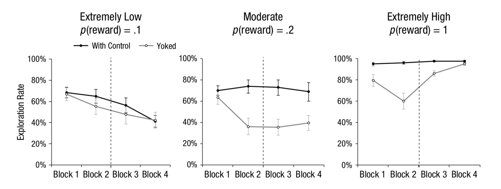

```{r}
articleID <- "3-10-2014_PS" # insert the article ID code here e.g., "10-3-2015_PS"
reportType <- 'final'
pilotNames <- "Gobi, Marc" # insert the pilot's name here e.g., "Tom Hardwicke". If there are multiple pilots enter both names in a character string e.g., "Tom Hardwicke, Bob Dylan"
copilotNames <- "Kyle MacDonald" # insert the co-pilot's name here e.g., "Michael Frank". If there are multiple co-pilots enter both names in a character string e.g., "Tom Hardwicke, Bob Dylan"
pilotTTC <- 720 # insert the pilot's estimated time to complete (in minutes, fine to approximate) e.g., 120
copilotTTC <- 100 # insert the co- pilot's estimated time to complete (in minutes, fine to approximate) e.g., 120
pilotStartDate <- as.Date("10/26/2017", format = "%m/%d/%y") # insert the pilot's start date in US format e.g., as.Date("01/25/18", format = "%m/%d/%y")
copilotStartDate <- as.Date("6/13/2018", format = "%m/%d/%y") # insert the co-pilot's start date in US format e.g., as.Date("01/25/18", format = "%m/%d/%y")
completionDate <- as.Date("", format = "%m/%d/%y") # copilot insert the date of final report completion (after any necessary rounds of author assistance) in US format e.g., as.Date("01/25/18", format = "%m/%d/%y")
```

-------

#### Methods summary: 

To test how exploration is affected by reward frequency and control, the researchers recruited 120 college students. The students were either in the with-control group, in which case outcome depended on their actions, or the yoked group, in which case outcome depended on the action of a with-control participant that they were paired with. 

Participants were shown a 12x10 grid of keys and asked to press keys for 100 trials (divided into 4 blocks, 25 trials each). Keys they already pressed (old keys) turned gray. Partipants paid 1 point to explore/press new keys (exploration cost) and 0 points to press old keys. Upon pressing a new key, participants in the with-control condition received 11 points with probability p and 0 points with probability 1-p when pressing new keys. Note, they still had to pay their "new key press" cost of 1 point. 

Participants in the yoked condition received whatever the with-control participant they were yoked to received on that trial during the first 50 trials but actually had control in the second 50 trials (i.e. they were treated like those in the with-control group). The study was 2 conditions (with-control / yoked) x 3 reward frequencies (p=0.1 extremely low, p=0.2 moderate, p=1 extremely high) and so the 120 participants were divided into 6 groups of 20 each. In such a setup, yoked participants would receive 11 points if they did not explore and 10 points if they did explore, on a trial when the with-control participant they were yoked to received a reward for exploring. 

A direct measure of perceived controllability was found by surveying participants of how much they felt in control of their outcomes in the first and second half of the trials. An indirect measure of perceived controllability was found by having all participants predict (over the course of 16 trials picked randomly (but ensuring first/second half samples were evenly picked) from the 100 trials completed by another player) the probability of four possible outcomes (explore+reward, no-explore+reward, explore+no-reward, no-explore+no-reward) for trial t+1. Low variance in predicted probabilities indicated that the participants thought that the other player does not have control over their outcomes, so they predicted the same probability every time, whereas high variance in predicted probabilities indicated that they do have control.

------

#### Target outcomes: 

> The top row of Figure 2 presents exploration rates (the percentage of trials in which participants tried new keys) across 4 blocks of 25 trials each. To further examine exploration rates, we conducted a 4 (block: 1, 2, 3, 4) × 3 (reward frequency: extremely low, moderate, extremely high) × 2 (control group: with-control, yoked) repeated measures analysis of variance (ANOVA), which revealed a significant three-way interaction, F(6, 342) = 3.35, p < .01, ηp 2 = .05. A post hoc Tukey’s test of exploration rates in the two control groups revealed that when the frequency of rewards from exploration was extremely low (p = .1), exploration rates decreased from about 70% in the first block to approximately 40% in the last block for both the with-control (p < .01) and the yoked (p < .01) groups. However, when reward frequency was moderate (p = .2), with-control participants continued to explore in about 70% of the trials, whereas yoked participants reduced their exploration rates to approximately 40%. This difference between the groups was evident in the second block (p < .01) and remained after yoked participants regained control (p < .01 and p = .09 for the third and fourth blocks, respectively). Finally, when reward frequency was extremely high (p = 1), yoked participants explored less than with-control participants in the second block (p < .01); however, this gap disappeared immediately after yoked participants regained control (ps > .9 for the third and fourth blocks). In summary, the classic learned-helplessness pattern was observed only when the reward frequency was moderate.

Here is the top row of Figure 2. Note that error bars represent represent ±1 SEM. And that points show the mean percentage of trials on which participants tried new keys.



------

```{r global_options, include=FALSE}
knitr::opts_chunk$set(echo=TRUE, warning=FALSE, message=FALSE)
```

# Step 1: Load packages

```{r}
library(tidyverse) # for data munging
library(knitr) # for kable table formating
library(haven) # import and export 'SPSS', 'Stata' and 'SAS' Files
library(readxl) # import excel files
library(CARPSreports) # custom report functions
library(car)
```

```{r}
# Prepare report object. This will be updated automatically by the reproCheck function each time values are compared.
reportObject <- data.frame(dummyRow = TRUE, reportedValue = NA, 
                           obtainedValue = NA, valueType = NA, 
                           percentageError = NA, comparisonOutcome = NA, 
                           eyeballCheck = NA)
```

# Step 2: Load data

```{r}
expldt = read_excel('data/LH_model_predictions_and_experimental_results.xlsx', 
                    col_names = TRUE) %>% 
  rename("p_reward" = "P(reward)", 
         "yoked" = "Yoked (0=with control)", 
         "1"="Exploration Rates_Block1", 
         "2"="Exploration Rates_Block2", 
         "3"="Exploration Rates_Block3", 
         "4"="Exploration Rates_Block4")
```

# Step 3: Tidy data

```{r}
expldt_tidy = expldt %>% gather(block, block_exploration, "1":"4") 
expldt_tidy = na.omit(expldt_tidy)
```

Change 1/0s to meaningful condition names.

```{r}
expldt_tidy <- expldt_tidy %>%
  mutate(yoked_condition = ifelse(yoked == 0, "with_control", "yoked"))
```

Make sure all variables are coded as factors.

```{r}
expldt_tidy <- expldt_tidy %>% 
  mutate(block_factor = factor(block),
         block = as.numeric(block),
         p_reward_factor = factor(p_reward),
         yoked_condition = factor(yoked_condition)) 
```

Check how many participants we have in each condition. From the Participants section, 

> One hundred twenty Technion students (52 female, 68 male; average age = 24 years).

From the results section,

> This resulted in a 3 (reward frequency) × 2 (control group) between-participants design that yielded six groups of 20 participants each

From footnote 3, 

> The number of participants in each group was determined a priori following previous studies that used a similar paradigm. No observations were excluded.

```{r}
expldt_tidy %>% 
  distinct(Subject, yoked_condition, p_reward) %>% 
  count(yoked_condition, p_reward) %>% 
  kable()
```

We can reproduce the number of participants in each condition and reward frequency condition. 

# Step 4: Run analysis

## Descriptive statistics

```{r}
ms <- expldt_tidy %>% 
  group_by(yoked_condition, p_reward, block) %>% 
  summarise(m = mean(block_exploration),
            stdev = sd(block_exploration),
            n = n(), 
            sem = stdev / sqrt(n)) %>% 
  mutate_if(is.numeric, round, digits = 3) 

ms %>% kable()
```

Try to reproduce their key plot. 

```{r}
ms %>% 
  ggplot(aes(x = block, y = m, color = yoked_condition)) +
  geom_line(aes(group = yoked_condition), size = 1) +
  geom_pointrange(aes(ymin = m - sem, ymax = m + sem)) +
  facet_wrap(~p_reward) +
  lims(y=c(0,1)) +
  theme_minimal() +
  theme(legend.position = 'top',
        panel.border = element_rect(colour = "grey", fill=NA, size=1))
```

Our plot looks pretty spot on when compared to the top row of Figure 2:


```{r}
reportObject <- reproCheck(reportedValue = 'figure', 
                           obtainedValue = ms[1,]$m, valueType = 'mean', eyeballCheck = TRUE)

reportObject <- reproCheck(reportedValue = 'figure', 
                           obtainedValue = ms[1,]$sem, valueType = 'se', eyeballCheck = TRUE)

reportObject <- reproCheck(reportedValue = 'figure', 
                           obtainedValue = ms[2,]$m, valueType = 'mean', eyeballCheck = TRUE)

reportObject <- reproCheck(reportedValue = 'figure', 
                           obtainedValue = ms[2,]$sem, valueType = 'se', eyeballCheck = TRUE)

reportObject <- reproCheck(reportedValue = 'figure', 
                           obtainedValue = ms[3,]$m, valueType = 'mean', eyeballCheck = TRUE)

reportObject <- reproCheck(reportedValue = 'figure', 
                           obtainedValue = ms[3,]$sem, valueType = 'se', eyeballCheck = TRUE)

reportObject <- reproCheck(reportedValue = 'figure',
                           obtainedValue = ms[4,]$m, valueType = 'mean', eyeballCheck = TRUE)

reportObject <- reproCheck(reportedValue = 'figure', 
                           obtainedValue = ms[4,]$sem, valueType = 'se', eyeballCheck = TRUE)

reportObject <- reproCheck(reportedValue = 'figure', 
                           obtainedValue = ms[5,]$m, valueType = 'mean', eyeballCheck = TRUE)

reportObject <- reproCheck(reportedValue = 'figure', 
                           obtainedValue = ms[5,]$sem, valueType = 'se', eyeballCheck = TRUE)

reportObject <- reproCheck(reportedValue = 'figure', 
                           obtainedValue = ms[6,]$m, valueType = 'mean', eyeballCheck = TRUE)
reportObject <- reproCheck(reportedValue = 'figure', 
                           obtainedValue = ms[6,]$sem, valueType = 'se', eyeballCheck = TRUE)

reportObject <- reproCheck(reportedValue = 'figure', 
                           obtainedValue = ms[7,]$m, valueType = 'mean', eyeballCheck = TRUE)
reportObject <- reproCheck(reportedValue = 'figure', 
                           obtainedValue = ms[7,]$sem, valueType = 'se', eyeballCheck = TRUE)

reportObject <- reproCheck(reportedValue = 'figure', 
                           obtainedValue = ms[8,]$m, valueType = 'mean', eyeballCheck = TRUE)
reportObject <- reproCheck(reportedValue = 'figure', 
                           obtainedValue = ms[8,]$sem, valueType = 'se', eyeballCheck = TRUE)

reportObject <- reproCheck(reportedValue = 'figure', 
                           obtainedValue = ms[9,]$m, valueType = 'mean', eyeballCheck = TRUE)
reportObject <- reproCheck(reportedValue = 'figure', 
                           obtainedValue = ms[9,]$sem, valueType = 'se', eyeballCheck = TRUE)

reportObject <- reproCheck(reportedValue = 'figure', 
                           obtainedValue = ms[10,]$m, valueType = 'mean', eyeballCheck = TRUE)
reportObject <- reproCheck(reportedValue = 'figure', 
                           obtainedValue = ms[10,]$sem, valueType = 'se', eyeballCheck = TRUE)

reportObject <- reproCheck(reportedValue = 'figure', 
                           obtainedValue = ms[11,]$m, valueType = 'mean', eyeballCheck = TRUE)
reportObject <- reproCheck(reportedValue = 'figure', 
                           obtainedValue = ms[11,]$sem, valueType = 'se', eyeballCheck = TRUE)

reportObject <- reproCheck(reportedValue = 'figure', 
                           obtainedValue = ms[12,]$m, valueType = 'mean', eyeballCheck = TRUE)
reportObject <- reproCheck(reportedValue = 'figure', 
                           obtainedValue = ms[12,]$sem, valueType = 'se', eyeballCheck = TRUE)

reportObject <- reproCheck(reportedValue = 'figure', 
                           obtainedValue = ms[13,]$m, valueType = 'mean', eyeballCheck = TRUE)
reportObject <- reproCheck(reportedValue = 'figure', 
                           obtainedValue = ms[13,]$sem, valueType = 'se', eyeballCheck = TRUE)

reportObject <- reproCheck(reportedValue = 'figure', 
                           obtainedValue = ms[14,]$m, valueType = 'mean', eyeballCheck = TRUE)
reportObject <- reproCheck(reportedValue = 'figure', 
                           obtainedValue = ms[14,]$sem, valueType = 'se', eyeballCheck = TRUE)

reportObject <- reproCheck(reportedValue = 'figure', 
                           obtainedValue = ms[15,]$m, valueType = 'mean', eyeballCheck = TRUE)
reportObject <- reproCheck(reportedValue = 'figure', 
                           obtainedValue = ms[15,]$sem, valueType = 'se', eyeballCheck = TRUE)

reportObject <- reproCheck(reportedValue = 'figure', 
                           obtainedValue = ms[1,]$m, valueType = 'mean', eyeballCheck = TRUE)
reportObject <- reproCheck(reportedValue = 'figure', 
                           obtainedValue = ms[1,]$sem, valueType = 'se', eyeballCheck = TRUE)

reportObject <- reproCheck(reportedValue = 'figure', 
                           obtainedValue = ms[16,]$m, valueType = 'mean', eyeballCheck = TRUE)

reportObject <- reproCheck(reportedValue = 'figure', 
                           obtainedValue = ms[16,]$sem, valueType = 'se', eyeballCheck = TRUE)

reportObject <- reproCheck(reportedValue = 'figure', 
                           obtainedValue = ms[17,]$m, valueType = 'mean', eyeballCheck = TRUE)

reportObject <- reproCheck(reportedValue = 'figure', 
                           obtainedValue = ms[17,]$sem, valueType = 'se', eyeballCheck = TRUE)

reportObject <- reproCheck(reportedValue = 'figure', 
                           obtainedValue = ms[18,]$m, valueType = 'mean', eyeballCheck = TRUE)

reportObject <- reproCheck(reportedValue = 'figure', 
                           obtainedValue = ms[18,]$sem, valueType = 'se', eyeballCheck = TRUE)

reportObject <- reproCheck(reportedValue = 'figure', 
                           obtainedValue = ms[19,]$m, valueType = 'mean', eyeballCheck = TRUE)

reportObject <- reproCheck(reportedValue = 'figure', 
                           obtainedValue = ms[19,]$sem, valueType = 'se', eyeballCheck = TRUE)

reportObject <- reproCheck(reportedValue = 'figure',
                           obtainedValue = ms[20,]$m, valueType = 'mean', eyeballCheck = TRUE)

reportObject <- reproCheck(reportedValue = 'figure', 
                           obtainedValue = ms[20,]$sem, valueType = 'se', eyeballCheck = TRUE)

reportObject <- reproCheck(reportedValue = 'figure', 
                           obtainedValue = ms[21,]$m, valueType = 'mean', eyeballCheck = TRUE)

reportObject <- reproCheck(reportedValue = 'figure', 
                           obtainedValue = ms[21,]$sem, valueType = 'se', eyeballCheck = TRUE)

reportObject <- reproCheck(reportedValue = 'figure', 
                           obtainedValue = ms[22,]$m, valueType = 'mean', eyeballCheck = TRUE)

reportObject <- reproCheck(reportedValue = 'figure', 
                           obtainedValue = ms[22,]$sem, valueType = 'se', eyeballCheck = TRUE)

reportObject <- reproCheck(reportedValue = 'figure',
                           obtainedValue = ms[23,]$m, valueType = 'mean', eyeballCheck = TRUE)

reportObject <- reproCheck(reportedValue = 'figure', 
                           obtainedValue = ms[23,]$sem, valueType = 'se', eyeballCheck = TRUE)

reportObject <- reproCheck(reportedValue = 'figure', 
                           obtainedValue = ms[24,]$m, valueType = 'mean', eyeballCheck = TRUE)

reportObject <- reproCheck(reportedValue = 'figure', 
                           obtainedValue = ms[24,]$sem, valueType = 'se', eyeballCheck = TRUE)
```

## Inferential statistics

> To further examine exploration rates, we conducted a 4 (block: 1, 2, 3, 4) × 3 (reward frequency: extremely low, moderate, extremely high) × 2 (control group: with-control, yoked) repeated measures analysis of variance (ANOVA), which revealed a significant three-way interaction, F(6, 342) = 3.35, p < .01, ηp2 = .05.

```{r}
m1 <- ez::ezANOVA(data = expldt_tidy, 
                  dv = block_exploration, 
                  wid = Subject, 
                  within = .(block_factor),
                  between = .(yoked_condition, p_reward_factor), 
                  detailed = TRUE,
                  type = 3)

m_output <- m1$ANOVA %>% mutate_if(is.numeric, round, digits = 4)

m1_dfn <- m_output$DFn[8]
m1_dfd <-  m_output$DFd[8]
m1_f <-  m_output$F[8]
m1_p <-  m_output$p[8]
m1_pes <-  m_output$SSn[8] / m_output$SSd[8]
```

Add ANOVA values to report object:

```{r}
reportObject <- reproCheck(reportedValue = "6", obtainedValue = m1_dfn, valueType = 'df')
reportObject <- reproCheck(reportedValue = "342", obtainedValue = m1_dfd, valueType = 'df')
reportObject <- reproCheck(reportedValue = "3.35", obtainedValue = m1_f, valueType = 'F')
reportObject <- reproCheck(reportedValue = "p < .01", obtainedValue = m1_p, valueType = 'p', eyeballCheck = TRUE)
reportObject <- reproCheck(reportedValue = ".05", obtainedValue = m1_pes, valueType = 'pes')
```

Next, we try to reproduce the post hoc Tukey tests. From the paper,

> A post hoc Tukey’s test of exploration rates in the two control groups revealed that when the frequency of rewards from exploration was extremely low (p = .1), exploration rates decreased from about 70% in the first block to approximately 40% in the last block for both the with-control (p < .01) and the yoked (p < .01) groups. 

```{r}
post_hoc_ms <- expldt_tidy %>% 
  filter(p_reward == "0.1") %>% 
  group_by(block_factor, yoked_condition) %>% 
  summarise(m = mean(block_exploration)) %>% 
  mutate_if(is.numeric, funs(round(. * 100, 0)))

post_hoc_ms %>% kable()
```

We are able to reproduce values that look "approximately" similar to the means reported for the post-hoc Tukey tests. Next, we try to reproduce the reported p-values.

```{r}
d_low_control <- expldt_tidy %>% 
  filter(yoked_condition == "with_control", 
         p_reward == "0.1", block %in% c(1, 4))

an_low_control <- aov(block_exploration ~ block_factor, data = d_low_control)
low_control_tuk <- TukeyHSD(an_low_control) 

reportObject <- reproCheck(reportedValue = "p < .01", obtainedValue = low_control_tuk$block_factor[4], 
                           valueType = 'p', eyeballCheck = TRUE)
```

Next we do the same thing but with the yoked condition

```{r}
d_low_yoked <- expldt_tidy %>% 
  filter(yoked_condition == "yoked",
         p_reward == "0.1", block %in% c(1, 4))

an_low_yoked <- aov(block_exploration ~ block_factor, data = d_low_yoked)
low_yoked_tuk <- TukeyHSD(an_low_yoked, "block_factor") 

reportObject <- reproCheck(reportedValue = "p < .01", obtainedValue = low_yoked_tuk$block_factor[4], 
                           valueType = 'p', eyeballCheck = FALSE)
```

We are unable to reproduce the repored p value ($p < .01$) for the yoked condition. We get `r round(low_yoked_tuk$block_factor[4], 3)`.

Next, we do the same analysis but focusing on differences between yoked-control in the moderate reward frequency and block. From the paper,

> However, when reward frequency was moderate (p = .2), with-control participants continued to explore in about 70% of the trials, whereas yoked participants reduced their exploration rates to approximately 40%. This difference between the groups was evident in the second block (p < .01) and remained after yoked participants regained control (p < .01 and p = .09 for the third and fourth blocks, respectively).

```{r}
d_moderate <- expldt_tidy %>% filter(p_reward == "0.2")

post_hoc_ms_mod <- d_moderate %>% 
  group_by(block_factor, yoked_condition) %>% 
  summarise(m = mean(block_exploration)) %>% 
  mutate_if(is.numeric, funs(round(. * 100, 0)))

post_hoc_ms_mod %>% kable()
```

Next, run the Tukey tests. 

```{r}
an_mod_block2 <- d_moderate %>% 
  filter(block == 2) %>% 
  aov(block_exploration ~ yoked_condition, data = .)

mod_block_tuk <- TukeyHSD(an_mod_block2) 

reportObject <- reproCheck(reportedValue = "p < .01", obtainedValue = mod_block_tuk$yoked_condition[4], 
                           valueType = 'p', eyeballCheck =  TRUE)
```

Next, we do the same analysis but focusing on Block 3.

```{r}
an_mod_block3 <- d_moderate %>% 
  filter(block == 3) %>% 
  aov(block_exploration ~ yoked_condition, data = .)

mod_block3_tuk <- TukeyHSD(an_mod_block3) 

reportObject <- reproCheck(reportedValue = "<.01", obtainedValue = mod_block3_tuk$yoked_condition[4], 
                           valueType = 'p', eyeballCheck = TRUE)
```

Same analysis, but with block 4. 

```{r}
an_mod_block4 <- d_moderate %>% 
  filter(block == 4) %>% 
  aov(block_exploration ~ yoked_condition, data = .)

mod_block4_tuk <- TukeyHSD(an_mod_block4)

reportObject <- reproCheck(reportedValue = ".09", obtainedValue = mod_block4_tuk$yoked_condition[4], 
                           valueType = 'p')
```

We got a lower p-value (p = `r round(mod_block4_tuk$yoked_condition[4], 2)`) than the one reported in the paper ($p = .09$).

The last Tukey tests focused on condition differences when reward frequency was high. From the paper,

> Finally, when reward frequency was extremely high (p = 1), yoked participants explored less than with-control participants in the second block (p < .01); however, this gap disappeared immediately after yoked participants regained control (ps > .9 for the third and fourth blocks). In summary, the classic learned-helplessness pattern was observed only when the reward frequency was moderate.

```{r}
d_high <- expldt_tidy %>% filter(p_reward == 1)

post_hoc_ms_high <- d_high %>% 
  group_by(block_factor, yoked_condition) %>% 
  summarise(m = mean(block_exploration)) %>% 
  mutate_if(is.numeric, funs(round(. * 100, 0)))

post_hoc_ms_high %>% kable()
```

Next, we try to reproduce the p-values.

```{r}
an_high_block2 <- d_high %>% 
  filter(block == 2) %>% 
  aov(block_exploration ~ yoked_condition, data = .)

high_block2_tuk <- TukeyHSD(an_high_block2)

reportObject <- reproCheck(reportedValue = "p < .01", 
                           obtainedValue = high_block2_tuk$yoked_condition[4], 
                           valueType = 'p', eyeballCheck = TRUE)
```

Same condition comparison, but with block 3

```{r}
an_high_block3 <- d_high %>% 
  filter(block == 3) %>% 
  aov(block_exploration ~ yoked_condition, data = .)

high_block3_tuk <- TukeyHSD(an_high_block3)

reportObject <- reproCheck(reportedValue = "p > .9", 
                           obtainedValue = high_block3_tuk$yoked_condition[4], 
                           valueType = 'p', eyeballCheck = FALSE)
```

We are unable to reproduce the p-value for the Block 3 comparison. We get $p < .05$. Note that this is a decision error in that they interpreted this test as a null p-value. 

```{r}
an_high_block4 <- d_high %>% 
  filter(block == 4) %>% 
  aov(block_exploration ~ yoked_condition, data = .)

high_block4_tuk <- TukeyHSD(an_high_block4)

reportObject <- reproCheck(reportedValue = "p > .9", 
                           obtainedValue = high_block4_tuk$yoked_condition[4], 
                           valueType = 'p', eyeballCheck = FALSE)
```

We are unable to reproduce the p-value for the Block 4 comparison. We get $p =$ `r round(high_block4_tuk$yoked_condition[4], 2)`. Note that this is NOT a decision error because the p-value is still above the p < .05 threshold.

# Step 5: Conclusion

We were able to reproduce the descriptive results presented in Figure 2. After assistance from the author, we were mostly able to reproduce the key 3-way from the repeated measures ANOVA. Specifically, we able to reproduce the degrees of freedom and the p-value. However, we still found minor error numerical error in the F-statistic and a major numerical error with the $\eta^2$, although it was a 20% difference with small numbers. 

We only able to reproduce a subset of the follow-up Tukey tests. It would be useful to get the following clarifications from the authors:

  * calculation that they used for the $\eta^2$ value in the repeated measures ANOVA
  * precisely what subsets of the data were used for each p-value reported in the follow-up Tukey tests

```{r}
Author_Assistance = TRUE # was author assistance provided? (if so, enter TRUE)

Insufficient_Information_Errors <- 0 # how many discrete insufficient information issues did you encounter?

# Assess the causal locus (discrete reproducibility issues) of any reproducibility errors. Note that there doesn't necessarily have to be a one-to-one correspondance between discrete reproducibility issues and reproducibility errors. For example, it could be that the original article neglects to mention that a Greenhouse-Geisser correct was applied to ANOVA outcomes. This might result in multiple reproducibility errors, but there is a single causal locus (discrete reproducibility issue).

locus_typo <- NA # how many discrete issues did you encounter that related to typographical errors?
locus_specification <- NA # how many discrete issues did you encounter that related to incomplete, incorrect, or unclear specification of the original analyses?
locus_analysis <- NA # how many discrete issues did you encounter that related to errors in the authors' original analyses?
locus_data <- NA # how many discrete issues did you encounter that related to errors in the data files shared by the authors?
locus_unidentified <- NA # how many discrete issues were there for which you could not identify the cause

# How many of the above issues were resolved through author assistance?
locus_typo_resolved <- NA # how many discrete issues did you encounter that related to typographical errors?
locus_specification_resolved <- NA # how many discrete issues did you encounter that related to incomplete, incorrect, or unclear specification of the original analyses?
locus_analysis_resolved <- NA # how many discrete issues did you encounter that related to errors in the authors' original analyses?
locus_data_resolved <- NA # how many discrete issues did you encounter that related to errors in the data files shared by the authors?
locus_unidentified_resolved <- NA # how many discrete issues were there for which you could not identify the cause

Affects_Conclusion <- NA # Do any reproducibility issues encounter appear to affect the conclusions made in the original article? This is a subjective judgement, but you should taking into account multiple factors, such as the presence/absence of decision errors, the number of target outcomes that could not be reproduced, the type of outcomes that could or could not be reproduced, the difference in magnitude of effect sizes, and the predictions of the specific hypothesis under scrutiny.
```

```{r}
reportObject <- reportObject %>%
  filter(dummyRow == FALSE) %>% # remove the dummy row
  select(-dummyRow) %>% # remove dummy row designation
  mutate(articleID = articleID) %>% # add the articleID 
  select(articleID, everything()) # make articleID first column

# decide on final outcome
if(any(reportObject$comparisonOutcome %in% c("MAJOR_ERROR", "DECISION_ERROR")) | Insufficient_Information_Errors > 0){
  finalOutcome <- "Failure without author assistance"
  if(Author_Assistance == T){
    finalOutcome <- "Failure despite author assistance"
  }
}else{
  finalOutcome <- "Success without author assistance"
  if(Author_Assistance == T){
    finalOutcome <- "Success with author assistance"
  }
}

# collate report extra details
reportExtras <- data.frame(articleID, pilotNames, copilotNames, pilotTTC, copilotTTC, pilotStartDate, copilotStartDate, completionDate, Author_Assistance, finalOutcome, Insufficient_Information_Errors, locus_typo, locus_specification, locus_analysis, locus_data, locus_unidentified, locus_typo_resolved, locus_specification_resolved, locus_analysis_resolved, locus_data_resolved, locus_unidentified_resolved)

# save report objects
if(reportType == "pilot"){
  write_csv(reportObject, "pilotReportDetailed.csv")
  write_csv(reportExtras, "pilotReportExtras.csv")
}

if(reportType == "final"){
  write_csv(reportObject, "finalReportDetailed.csv")
  write_csv(reportExtras, "finalReportExtras.csv")
}
```

# Session information

```{r session_info, include=TRUE, echo=TRUE, results='markup'}
devtools::session_info()
```
